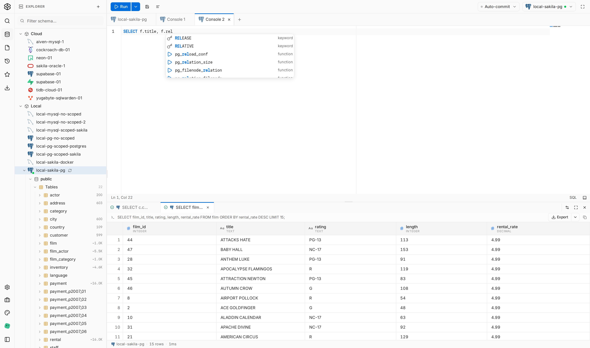

# SQLWarden

**A self-hosted database access platform and SQL editor for teams that need controlled, auditable access to production and non-production databases.**

SQLWarden pairs a Go backend and an embedded React SQL editor with custom RBAC, so teams can grant scoped database access without handing out raw credentials. Organizations, workspaces, environments, and connections model how real teams separate production from staging from a developer's personal sandbox.

> SQLWarden is pre-1.0. The API and database schema may still change while the project is being shaped.

<picture>
  <source media="(prefers-color-scheme: dark)" srcset="docs/assets/screenshot-dark.png">
  <source media="(prefers-color-scheme: light)" srcset="docs/assets/screenshot-light.png">
  
</picture>

## Table of Contents

- [Features](#features)
- [Supported Databases](#supported-databases)
- [Quick Start](#quick-start)
- [Building From Source](#building-from-source)
- [Configuration](#configuration)
- [Development](#development)
- [Repository Layout](#repository-layout)
- [API and Architecture](#api-and-architecture)
- [Security Notes](#security-notes)
- [Contributing](#contributing)
- [Releases](#releases)

## Features

- **Self-hosted, single binary** — an embedded web UI ships inside the Go server; no separate frontend deployment.
- **Organizations, workspaces, environments, connections** — model real team structure instead of one flat list of database credentials.
- **Custom additive RBAC** — fine-grained roles and policies, with effective-permissions APIs the frontend uses to drive capability checks.
- **Workspace and personal spaces** — shared team resources alongside an individual sandbox for personal database work.
- **Broad database support** — PostgreSQL, MySQL, SQL Server, Oracle, SQLite, and popular wire-compatible variants; see [Supported Databases](#supported-databases).
- **Full SQL editor** — workspace tabs, a schema explorer, editor and console tabs, result panes, and same-browser multi-window sync.
- **Cancellable query execution** — stop long-running queries from the UI without waiting them out.
- **Workspace file storage** — private and shared file scopes for saved queries and scripts.
- **SQLite or PostgreSQL for the app database** — SQLite by default for easy self-hosting, PostgreSQL when you need to scale out.
- **Config file, env vars, or CLI flags** — configure however fits your deployment.

## Supported Databases

| Database | Compatibility | Status |
| --- | --- | --- |
| PostgreSQL | Native | Supported |
| MySQL | Native | Supported |
| SQLite | Native | Supported |
| SQL Server | Native | Supported |
| Oracle | Native | Supported |
| MariaDB | MySQL-compatible | Supported |
| TiDB | MySQL-compatible | Supported |
| CockroachDB | Postgres-compatible | Supported |
| YugabyteDB | Postgres-compatible | Supported |
| Neon | Postgres-compatible | Supported |
| Supabase | Postgres-compatible | Supported |
| MongoDB | — | Coming soon |
| ClickHouse | — | Coming soon |
| Snowflake | — | Coming soon |
| BigQuery | — | Coming soon |
| Amazon Redshift | — | Coming soon |
| Redis | — | Coming soon |
| DuckDB | — | Coming soon |
| libSQL | — | Coming soon |
| Apache Cassandra | — | Coming soon |
| Apache Druid | — | Coming soon |
| Apache Trino | — | Coming soon |
| Elasticsearch | — | Coming soon |

SQLite target connections (as opposed to the SQLite application database) are gated per instance and disabled for in-memory sources by default — see [Configuration](#configuration).

## Quick Start

The fastest way to run SQLWarden is Docker. Released images are published to GitHub Container Registry.

```sh
docker run --rm \
  --name sqlwarden \
  -p 6020:6020 \
  -v sqlwarden-data:/var/lib/sqlwarden \
  -e BASE_URL=http://localhost:6020 \
  -e DB_DSN=/var/lib/sqlwarden/sqlwarden.db \
  -e FILES_ROOT_DIR=/var/lib/sqlwarden/files \
  -e COOKIE_SECRET_KEY=replace-with-a-random-secret \
  -e JWT_SECRET_KEY=replace-with-a-random-secret \
  -e ENCRYPTION_KEY=replace-with-a-random-secret \
  ghcr.io/sqlwarden/sqlwarden:latest
```

Open `http://localhost:6020` and complete first-run setup. Use the latest published release tag for production deployments. The secrets above are placeholders — replace them before exposing the service to users.

For local development with a PostgreSQL application database, use the bundled Compose file instead, which builds the image from source and starts both services:

```sh
docker compose up --build
```

See [docker-compose.yml](docker-compose.yml) for the full service definitions and default credentials.

### Download a Release Binary

Prebuilt binaries for Linux, macOS, and Windows (amd64 and arm64) are published on the [GitHub Releases page](https://github.com/sqlwarden/sqlwarden/releases/latest).

**Linux / macOS**

```sh
tar -xzf sqlwarden_<version>_<os>_<arch>.tar.gz
./sqlwarden
```

**Windows**

```powershell
Expand-Archive sqlwarden_<version>_windows_<arch>.zip
.\sqlwarden.exe
```

Open `http://localhost:6020` and complete first-run setup. By default the application database lives at `~/.sqlwarden/sqlwarden.db` and uploaded files at `~/.sqlwarden/files`.

## Building From Source

Prerequisites:

- Go 1.26.4 or newer.
- Bun for frontend dependency installation and builds.

```sh
make build
./dist/sqlwarden
```

For development with API query logging enabled:

```sh
make run
```

## Configuration

SQLWarden can be configured with a config file, environment variables, or CLI flags. See [docs/configuration.md](docs/configuration.md) for the full reference, including every available setting.

Common settings:

```sh
BASE_URL=http://localhost:6020
HTTP_PORT=6020
DB_DRIVER=sqlite
DB_DSN=~/.sqlwarden/sqlwarden.db
FILES_ROOT_DIR=~/.sqlwarden/files
```

To see available flags:

```sh
./dist/sqlwarden --help
```

## Development

Install frontend dependencies:

```sh
make frontend/install
```

Build the frontend and backend:

```sh
make build
```

Run backend tests:

```sh
make test
```

Run the full local audit suite:

```sh
make audit
```

Run the Vite development server with API proxying:

```sh
make frontend/dev
```

Install repository-managed git hooks:

```sh
make hooks/install
```

## Repository Layout

```text
assets/                       Embedded migrations, email templates, and frontend build output
cmd/api/                      Server entrypoint
docs/                         Architecture and operator documentation
frontend/                     React application
internal/access/              RBAC permissions, roles, policies, and enforcer
internal/connection/          Live target database sessions
internal/database/            Bun models and database setup
internal/engine/              Target database engine integrations and capabilities
internal/files/               Workspace file service
internal/filestore/           File content storage backend
internal/web/                 HTTP app, config, routes, middleware, handlers
pkg/result/                   Normalized target query result types
```

`cmd/api` is intentionally thin. Reusable HTTP behavior belongs in `internal/web` so future entrypoints, including desktop packaging, can wrap the same application.

## API and Architecture

The committed architecture reference is [docs/sqlwarden-architecture.md](docs/sqlwarden-architecture.md).

The API currently uses `/api/v1`, standard JSON error envelopes, and paginated list envelopes for UI-facing list endpoints. SQLWarden is still before v1, so compatibility-breaking cleanup can happen before the first stable release.

## Security Notes

SQLWarden is designed for self-hosted deployments. Operators are responsible for network placement, TLS termination or built-in TLS configuration, secret management, backups, and database access boundaries.

Before production use:

- Replace `COOKIE_SECRET_KEY`, `JWT_SECRET_KEY`, and `ENCRYPTION_KEY`.
- Use HTTPS through a reverse proxy or built-in TLS.
- Review whether personal spaces should be enabled.
- Review whether SQLite target connections should be enabled.
- Use PostgreSQL for the application database when SQLite is not appropriate for the deployment size or operating model.

Security-sensitive defaults are intended to make local development easy, not to harden production automatically.

## Contributing

Contributions are welcome. See [CONTRIBUTING.md](CONTRIBUTING.md) for commit conventions, the development workflow, and the release process.

## Releases

The project uses conventional commits, Release Please, and GoReleaser. Release builds publish server binaries and container images from version tags.

Use squash or rebase workflows that keep `main` linear and preserve clear conventional commit messages for user-facing changes.
